# Illuminations

**Illuminations** is a client sided Minecraft Fabric mod that adds multiple ambient particles in order to make your world more enjoyable at night or in dark places.

*(All screenshots with a bloom effect were taken with Canvas Renderer)*

## Illuminations types

### Fireflies

**Fireflies** are small flying insects that come out during the night and disappear when the sun rises. They will appear in small quantities in jungle, plains, savanna and taiga type biomes, medium quantities in forest and river type biomes and great quantity in swamp type biomes.

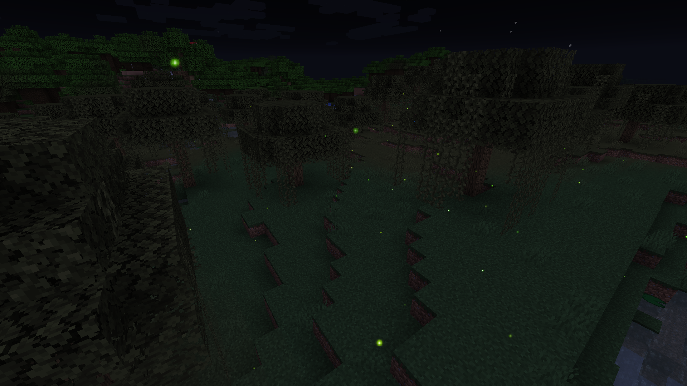

### Chorus Petals

Appearing near Chorus flowers, these beautiful petals will twirl down to the ground, to the winds of the End, transitioning from a beautiful white to a majestic purple. The younger the flower is, the more petals will appear, and breaking a Chorus flower will provoke a burst of petals (again, the younger the flower, the more petals will burst).

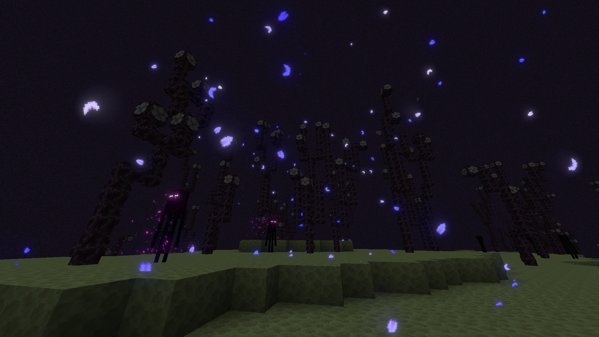

### Glowworms

**Glowworms** are small larvae living in caves by sticking to the ceiling that will fall down if their support block is removed. They will appear in small quantities in jungle, plains, savanna and taiga type biomes, medium quantities in forest and river type biomes and great quantity in swamp type biomes.

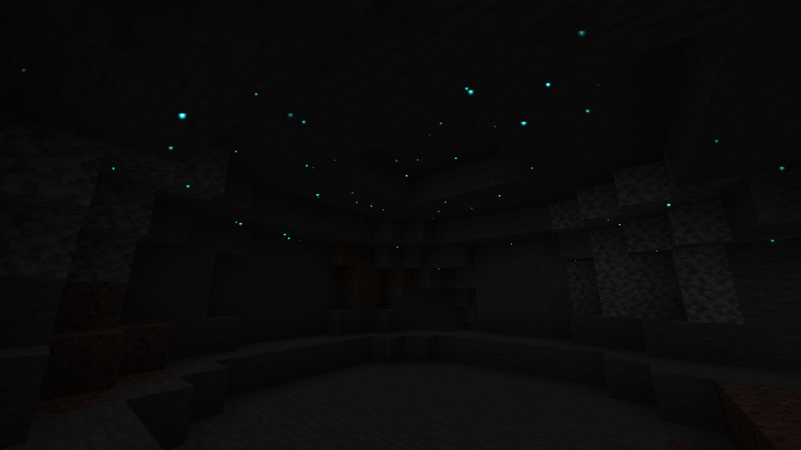

### Plankton

Glowing **plankton** - even though difficult to notice because of its size - can be found floating around in the dark parts of the oceanic depths. They appear in any ocean biome as long as the light is sufficiently low.

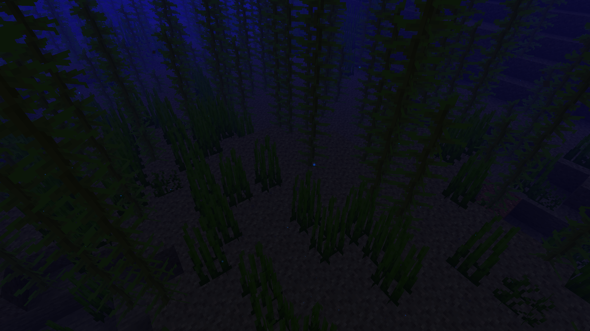

### "Autumnflies"

During the month of October, fireflies will adopt an orange tint instead of their regular green one.

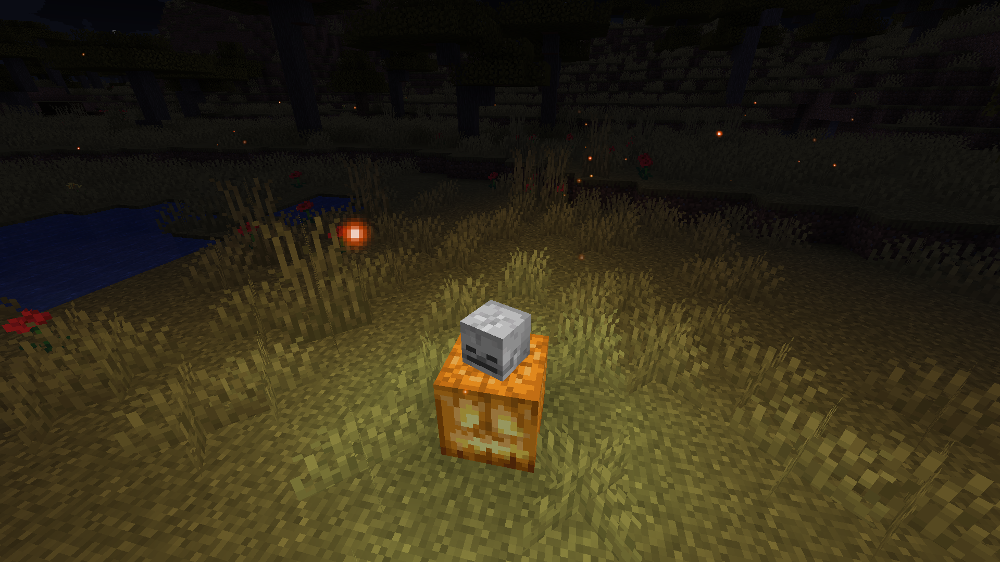

### Eyes in the Dark

Also during the month of October, you may come across glowing eyes in absolutely dark spots. These eyes will disappear if you come too close or if their darkness is disturbed by a light source.

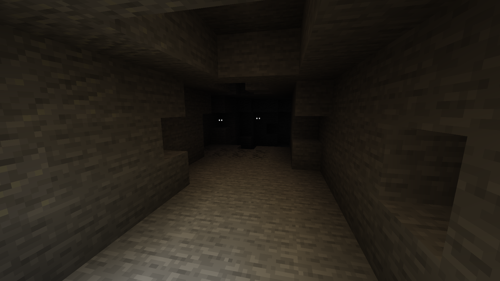

## Configurability

Illuminations possesses a few config options you can use to change how the mod behaves to better fit your needs.

### Eyes in the Dark

Enable glowing eyes appearing in low light environments. Set on ENABLE by default.
- ENABLE: Eyes will appear during October
- DISABLE: Eyes will never appear
- ALWAYS: Eyes will appear no matter the date

### Spawn Density

The spawn rate percentage multiplier. Does not affect eyes in the dark.
0% Disables illuminations, 1000% Multiplies the amount of illuminations appearing by 10.

## Cosmetics

**Auras** are special Illuminations effects around the player visible to other players that have the mod. Auras currently serve as a bonus for donators that support the mod and are purely cosmetic with no other provided advantage whatsoever. They are visible to other players with Illuminations installed (even on vanilla servers).

**Overheads** are cosmetics that float above player heads. They are visible to other players with Illuminations installed (even on vanilla servers).

Auras and overheads can be selected and changed via the [Illuminations dashboard](https://illuminations.uuid.gg/).

### Twilight aura

The **Twilight** aura creates colored fireflies  that will orbit around the player. The color of the fireflies can be changed to any color you want via the Illuminations dashboard. If the player moves, they will leave a trail of these fireflies. This aura is available to tier 1 donators.

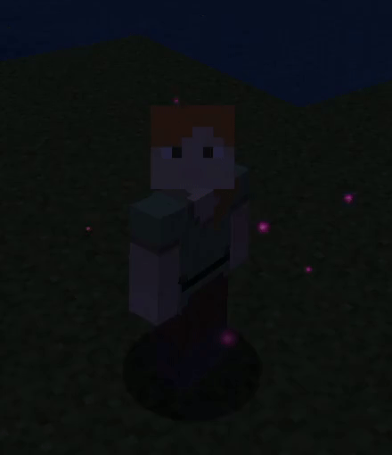

### Ghostly aura

The **Ghostly** aura emanates little ghosts that fly upward and gradually appear and disappear. This aura is available to tier 2 donators.

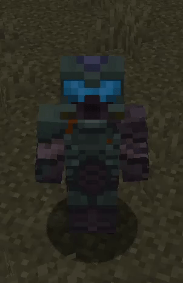

### Frost and Solar crowns

3D overheads fit for a king or queen, that will either make you insanely cool, or astoundingly hot, depending on your choice.

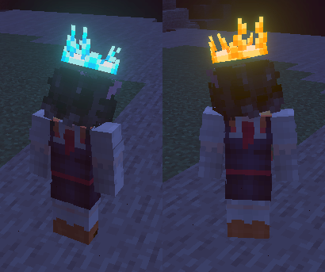

### Bloodfiend, Dreadlich and Mooncult crowns

*Designed by ArathainFarqoe!*

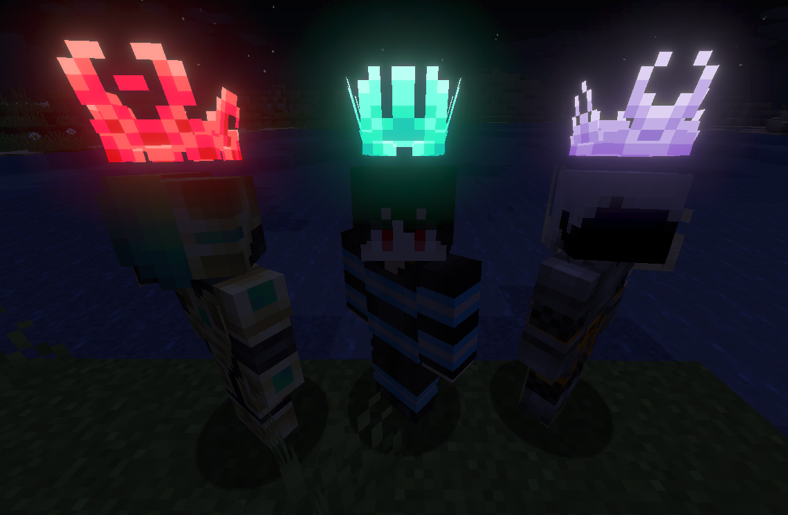

### Chorus aura and crown

### Pride (and trans pride) heart

Available for free to anyone that registers for an Illuminations account. https://illuminations.uuid.gg/pride

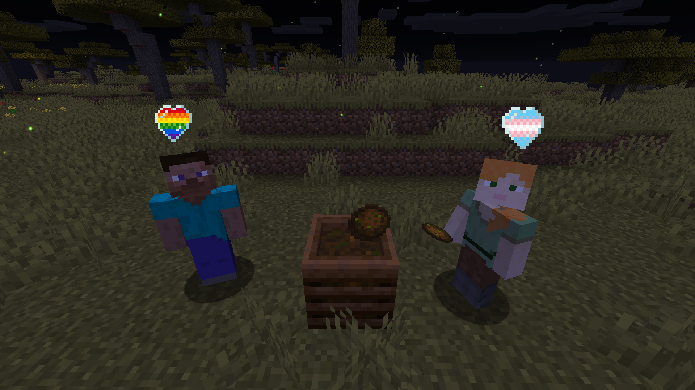

### Jacko

A happy jack o' lantern that lights up at night and in dark areas. Available to tier 2 donators.

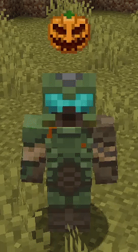

## FAQ

#### Can I include this mod in a modpack?

**Yes**: You can. Go ahead, don't bother asking. Please however provide credit and a link to either the GitHub repository or Curse Forge project page.

#### Can I use this mod on a vanilla server?

**Yes**: If you have installed this mod on your Minecraft client, you will be able to connect to vanilla Minecraft servers and the ambient illuminations will work as intended.

#### Are cosmetics visible to other players?

**Yes**: If the player has the mod installed on their client, all your cosmetics will be visible to them, just like theirs will be visible to you.

#### How to get an aura or crown?

**Auras are currently only available to donators**, [more information here](https://illuminations.uuid.gg/register).

#### I want to change my cosmetics / the color of my prismatic auras / disable it, what do I do?

If you have donated multiple times, you may have multiple auras and may want to select a specific one. Or you may just simply want to change your prismatic color or disable your aura. **You can do all this via the [Illuminations dashboard](https://illuminations.uuid.gg/)** with no restrictions whatsoever.

###### Copyright (C) 2021 Ladysnake

This program is free software: you can redistribute it and/or modify
it under the terms of the GNU General Public License as published by
the Free Software Foundation, either version 3 of the License, or
(at your option) any later version.

This program is distributed in the hope that it will be useful,
but WITHOUT ANY WARRANTY; without even the implied warranty of
MERCHANTABILITY or FITNESS FOR A PARTICULAR PURPOSE.  See the
GNU General Public License for more details.

You should have received a copy of the GNU General Public License
along with this program.  If not, see <http://www.gnu.org/licenses/>.
